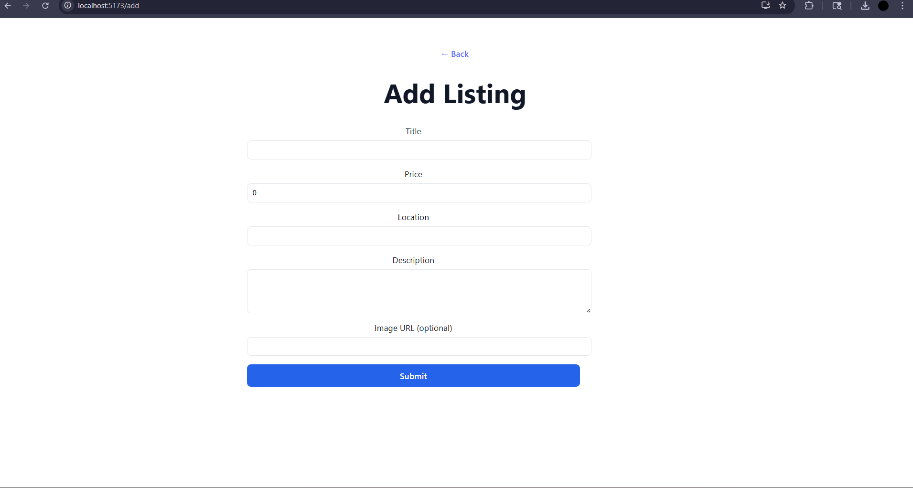

# Property Listings App

## To Run it Locally

### Backend (FastAPI)
```bash
cd backend
python -m venv venv
# Windows: venv\Scripts\activate
# macOS/Linux:
source venv/bin/activate
pip install -r requirements.txt
-m uvicorn main:app --reload --host 127.0.0.1 --port 8000
```
FastAPI will serve at: `http://127.0.0.1:8000`

### Frontend (React + Vite)
```bash
cd frontend
npm install
npm run dev
```
Vite dev server will serve at: `http://localhost:5173`

### CORS
Allow the frontend origin (5173) in the FastAPI CORS config if not already set.

---

## API (FastAPI)

- **GET `/listings`** – return all listings
- **POST `/listings`** – add a listing (`title`, `price`, `location`, `description`, optional `image_url`)
- **GET `/listings/:id`** – return one listing by id
- **POST `/listings/:id/summary`** – return a 3‑bullet summary of the listing description

Response shape is simple JSON with `id`, `title`, `price`, `location`, `description`, and `image_url` if provided.

---

## Screenshots

Put images in `./screenshots`. When you have them, remove the comment block below to show them in the README.





---

## Design Choices & Tradeoffs

- **Lightweight storage**: In‑memory by default for speed. SQLite or a JSON file are fine if you want persistence.
- **FastAPI**: Small surface area, type‑safe models, and fast iteration.
- **React + Tailwind**: Minimal styling overhead; easy to keep the UI clean.
- **Intentional omissions**: No auth, no role system, no cloud database. This keeps the focus on core flows.

---

## Tooling Notes (how I worked)

- Used a coding assistant for scaffolding and documentation drafts; everything here was reviewed and trimmed for clarity.
- Saved about **3 hours** compared to doing all boilerplate and docs by hand.
- Suggestion not used: swapping Tailwind for a full component suite and a multi‑step form; rejected to keep the UI minimal and the code footprint small.

Short prompt snippets I used to drive the assistant:
1. “give me some options to choose for the UI… we will make the prompt”
2. “option 1, also give me whole techy stack for frontend”
3. “now for backend, same. API endpoints… fastapi”
4. “i dont need code, only text for project doc”

---

## Testing

Below are simple copy‑paste checks to validate the happy path and an edge case. Adjust payloads as needed.

### Happy‑path
1) Create a listing
```bash
curl -X POST http://127.0.0.1:8000/listings   -H "Content-Type: application/json"   -d '{ "title":"Sunny 2BR", "price":1450, "location":"Dallas, TX", "description":"South‑facing, near transit", "image_url":"https://example.com/a.jpg" }'
```
Note the returned `id`.

2) Fetch it by id
```bash
curl http://127.0.0.1:8000/listings/<ID_FROM_STEP_1>
```

### Edge case
Request a listing that does not exist:
```bash
curl -i http://127.0.0.1:8000/listings/does-not-exist
```
Expected: `404 Not Found` with a short error message.

---

## Folder Structure (suggested)

```
repo-root/
  backend/
    main.py
    requirements.txt
    data/            # optional: sqlite db file or listings.json
  frontend/
    index.html
    src/
      main.jsx
      App.jsx
      pages/
        Home.jsx
        ListingDetail.jsx
        AddListing.jsx
      components/
        PropertyCard.jsx
        SearchBar.jsx
        ListingForm.jsx
    package.json
    tailwind.config.js
  screenshots/      # drop images referenced in README
  README.md
```

---

## Notes

- If you switch away from in‑memory storage, pick **one** (SQLite or JSON) and keep it consistent across runs.
- Keep the UI minimal: white background, centered search, simple cards, clear form.
- This is a demo; hardening (auth, rate limiting, migrations) is out of scope.
